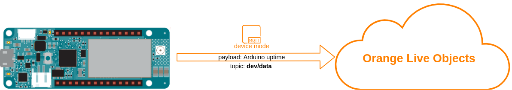

# Send data to LiveObjects

This example show how to send some example data(device uptime) to LiveObjects using Arduino MKR1500


## Running
first of all, be sure that you installed required libraries and generated api key mentioned in main README file, then:
1. Open "1_send_data.ino" sketch using Arduino IDE
2. Replace ```const char SECRET_LIVEOBJECTS_API_KEY[]="...";``` in arduino_secrets.h with api key you generated .
3. Upload *1_send_data.ino* sketch to your Arduino MKR1500 board


## Verify
**Is device is online:**<br>
If all went fine under **devices** tab on Live LiveObjects portal you should see online device identified by modem IMEI:


**Is device sending data:**<br>
Under data tab on LiveObjects portal you should see messages from stream identified by modem IMEI, along with values *{ "uptime": xxxxx }*

