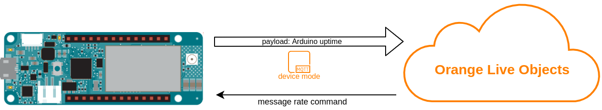
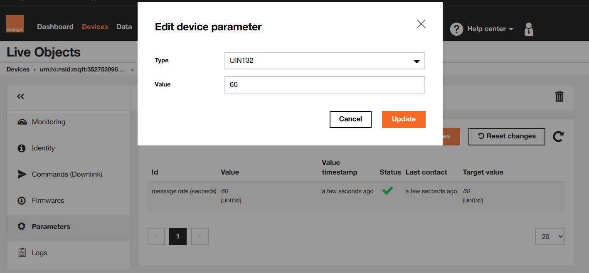

# Live Objects parameters with callbacks

Parameters give you ability to configure your device over the air from Live Objects. In this example we will use a parameter to adjust time rate on which messages from device are sent.<br>



Additionally in this example we will use a "callback" function which will convert the rate value received as parameter (in seconds) to Arduino-native milliseconds.

This is how callback function will look like:<br>
``void processMsgRate() {
  messageRateInMs = messageRate * 1000;
}``


## Running
First of all, be sure that you installed the required libraries and generated an API key mentioned in the main README file, then:
1. Open "1_send_data.ino" sketch using Arduino IDE
2. Replace ```const char SECRET_LIVEOBJECTS_API_KEY[]="...";``` in arduino_secrets.h with API key you generated
3. Upload *3_parameter_with_callback.ino* sketch to your Arduino MKR NB 1500 board


## Verify
**Is device online:**<br>
If all went fine under **devices** tab on Live Live Objects portal you should see online your device identified by its modem IMEI

**Is device sending data:**<br>
Under data tab on Live Objects portal you should see messages sent by your device, along with values *{ "uptime": xxxxx }*

## Send parameter
Now you can adjust the rate on which messages are sent from the Live Objects (default is 60s). To do this navigate to:<br>
**Devices->urn:lo:nsid:mqtt:[your_device_imei]->Parameters** <br>
You should see parameter named "message rate (seconds)" there; feel free to modify and test if message rate is sending changes accordingly:


