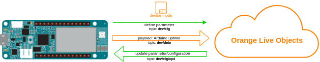

# LiveObjects parameters with callbacks

Parameters give you ability to configure device device from LiveObjects portal, in this example we will use parameter to adjust time rate on which messages from device are sent.<br>



Additionally in this example we will use "callback" function which will convert value(in seconds) received in command to arduino native delay milliseconds:

This is how callback function will look like:<br>
``void processMsgRate() {
  messageRateInMs = messageRate * 1000;
}``


## Running
first of all, be sure that you installed required libraries and generated api key mentioned in main README file, then:
1. Open *3_parameter_with_callback.ino* sketch using Arduino IDE
2. Replace ```const char SECRET_LIVEOBJECTS_API_KEY[]="...";``` in arduino_secrets.h with api key you generated .
3. Upload *3_parameter_with_callback.ino* sketch to your Arduino MKR1500 board


## Verify
**Is device is online:**<br>
If all went fine under **devices** tab on Live LiveObjects portal you should see online device identified by modem IMEI

**Is device sending data:**<br>
Under data tab on LiveObjects portal you should see messages from stream identified by modem IMEI, along with values *{ "uptime": xxxxx }*

## Send parameter
Now using command which you can send from LiveObjects portal you can adjust rate on which messages are sent(default is 60s), to do this navigate to:<br>
**Devices->urn:lo:nsid:mqtt:[your_device_imei]->Parameters** <br>
You should see parameter named "message rate(seconds)" there, feel free to modify and test if message rates changes accordingly:

