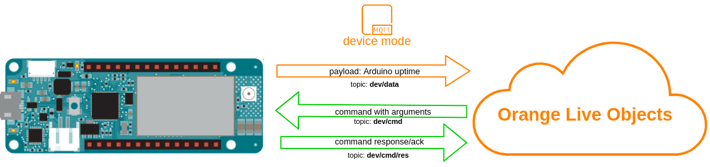

# LiveObjects device commands with arguments

Commands are used to sent request of performing some action by device, additionally when defining command on LiveObjects portal you can add some arguments to them, which then will be handled by device.



In this example we will use command to make Arduino onboard LED blink. Unlike in previous example where blink time and count was fixed, this time led on/off time and repetitions will be defined as arguments for command sent from LiveObjects portal.


## Running
first of all, be sure that you installed required libraries and generated api key mentioned in main README file, then:
1. Open "5_simple_command.ino" sketch using Arduino IDE
2. Replace ```const char SECRET_LIVEOBJECTS_API_KEY[]="...";``` in arduino_secrets.h with api key you generated .
3. Upload *5_simple_command.ino* sketch to your Arduino MKR1500 board

## Verify
**Is device is online:**<br>
If all went fine under **devices** tab on Live LiveObjects portal you should see online device identified by modem IMEI

## Send command
Now navigate to:<br>
**Devices->urn:lo:nsid:mqtt:[your_device_imei]->Commands** <br>
And click **"Add command"**<br>

Define command like this:

And after clicking "Verify" your command should be sent to device and as effect you should see Arduino onboard LED according to parameters which you provided
