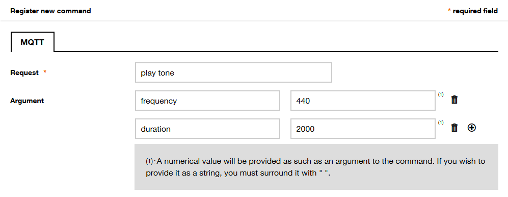

# Prototype with Orange using Live Objects and Arduino MKR Boards

### Discover Orange  [**Live Objects**](https://liveobjects.orange-business.com) using dedicated SDK for [**Arduino MKR family boards**](https://store.arduino.cc/arduino-genuino/arduino-genuino-mkr-family).

This code wraps all the functions necessary to make your object work with Live Objects.

You can declare parameters, which you can later update OTA from Live objects. You can also create commands to trigger actions remotely.

The code will manage the LTE-M, GSM and WiFi connection (depending on currently used board), as well MQTT(S) and SMS exchanges with Live objects under the hood to keep your parameters up to date or execute the commands received without you having to take care of them (apart from writing the code of these commands, of course).

## Compatibility ##
| Board | MQTT | MQTTS | SMS |
| :--- | :---: | :---: | :---: |
| Arduino MKR1000 WIFI | OK | - | - |
| Arduino MKR 1010 WiFi | OK | OK | - |
| Arduino MKR 1400 GSM | OK | OK | OK |
| Arduino MKR 1500 NB | OK | OK | OK |
| Arduino MKR VIDOR 4000 | OK | OK* | - |
| Arduino Nano 33 IoT | OK | OK | - |
| ESP8266 Boards | OK | OK** | - |
| ESP32 Boards | OK | OK | - |
| Adafruit Feather M0 WiFi| OK | OK | - |
| Adafruit Feather 32u4 | OK | - | OK |

## Prerequisites/dependecies ##
This code needs 2 ~~3~~ external libraries to run, that you can install using the built-in [Library Manager](https://www.arduino.cc/en/guide/libraries) of the Arduino IDE.

#### Libraries provided by Arduino
- [MKRNB](https://www.arduino.cc/en/Reference/MKRNB) in order to handle the LTE-M module on **Arduino MKR NB 1500**
- [MKRGSM](https://www.arduino.cc/en/Reference/MKRGSM) in order to handle the GSM module on **Arduino MKR GSM 1400**
- [WiFiNINA](https://www.arduino.cc/en/Reference/WiFiNINA) in order to handle WiFi module on **Arduino MKRWIFI 1010** and **Arduino Nano 33 IoT**
- [WiFi101](https://www.arduino.cc/en/Reference/WiFi101) in order to handle WiFi module on **Arduino MKR 1000**
- [ArduinoBearSSL](https://www.arduino.cc/reference/en/libraries/arduinobearssl) in order to handle 2-way MQTTS connection through **IoT SAFE** (disabled by default, must be enabled by defining LIVE_OBJECTS_IOT_SAFE in LiveObjectsConfig.h)

- ~~[ArduinoMqttClient](https://github.com/arduino-libraries/ArduinoMqttClient) that implements a MQTT client for Arduino~~ *

 \* currently integrated into this SDK, until https://github.com/arduino-libraries/ArduinoMqttClient/pull/44 fix will be merged

#### Library for ESP8266 and ESP32 boards
- [PubSubClient](https://pubsubclient.knolleary.net/) library provides a client for doing simple publish/subscribe messaging with a server that supports MQTT

#### Library developed by Benoît Blanchon*
*mandatory for both Arduino, ESP and Adafruit boards
- [ArduinoJson](https://arduinojson.org/), a powerful library used to parse, store and handle JSON easily

#### Library developed by Orange
*mandatory to handle 2-way MQTTS connection through **IoT SAFE** (disabled by default, must be enabled by defining LIVE_OBJECTS_IOT_SAFE)
- [IoT-SAFE-APDU-library](https://github.com/Orange-OpenSource/IoT-SAFE-APDU-library)

#### SAMD21 Arduino core
- You also need to install the Arduino core for Atmel SAMD21 processor, used on the boards of the MKR family. Open the [Boards Manager](https://www.arduino.cc/en/guide/cores) and install the package called "Arduino SAMD Boards (32-bit ARM Cortex-M0+)".

## How to use ##

1. Log in to [Live Objects](https://liveobjects.orange-business.com) or request a [trial account](https://liveobjects.orange-business.com/#/request_account) (up to 10 devices for 1 year) if you don't have one.
2. Create an [API key](https://liveobjects.orange-business.com/#/administration/apikeys) for your device. Give it a name, select the *Device access* role and validate. Copy the key.
3. Clone or download the directory from Github.
4. In the **'src/arduino_secrets.h'** file :
   - Paste it as initialization value for the `SECRET_LIVEOBJECTS_API_KEY` variable in the 'arduino_secrets.h' file -keep the double quotes!
   
   In case of feather 32u4 you have to change type of this variable to char* from String 
   - Fill in the connection(WIFI or GSM) credentials if needed (pin code, APN information, etc). In case of GSM connection, most of the time, APN will set up automatically. Your SIM card may have a default pin code (like "0000"), unless you deactivated it using the [Pin management](https://github.com/arduino-libraries/MKRNB/blob/master/examples/Tools/PinManagement/PinManagement.ino) sketch, provided with the MKRNB library.

   In case of feather32u4 you have to change APN in library file LiveObjectsFona.cpp 
   
   Line ~165 - m_Fona.setGPRSNetworkSettings(F("APN"), F(""), F(""));
5. Import library into the Arduino IDE, to do this select: *Sketch-> Include Library-> Add .ZIP Library* and select folder which you cloned in the previous step(actually it doesn't need to be .ZIP-ed to be imported). After successful import you should see example sketches in *File->Examples->LiveObjectsSDK*

6. Modules MKR 1010 WiFi, MKR VIDOR 4000, Nano 33 IoT should work "out of the box" using MQTTS. If not, you need to upgrade theirs firmwares and certificates using embedded updater in Arduino IDE:
*Tools -> WiFi101/WiFiNINA Firmware Updater*.

**Optionally for ESP8266 for getting MQTTS:

ESP8266 can use MQTT as default. If you want to use MQTTS, you need to do below steps.

Install [**ESP8266 updater**](https://github.com/esp8266/arduino-esp8266fs-plugin) plugin for Arduino IDE.

File `certs.ar` containing necessary certificates is included in this repository. 

Below procedure run once, puts file containing certificates in ESP8266 filesystem:
- run Arduino IDE,
- create a new (empty) sketch (eg. ***ESP8266fs.ino***),
- save it in some folder (eg. ***certificates***),
- create subfolder ***data*** in prepared folder ***certificates***,
- put file `certs.ar` (please do not change name because it is called by SDK) into ***data*** subfolder,
- open sketch ***ESP8266fs.ino*** (if necessary),
- close Serial Monitor (if opened),
- use tool to upload : *Tools -> ESP8266 Sketch Data Upload*.

## Developer guide ##

### Declare parameters ###
You can update over the air some parameters of your sketch using Live Objects's MQTT Parameters. Parameters and Commands must be declared _before_ your device connects to Live Objects.

You can declare parameters with the `addParameter()` instruction, which accepts the following arguments:
- the label of your parameter (_const char*_ expected) as it will be displayed on Live Objects;
- the variable your parameter is stored in (the variable can be of any type **except** _char*_, _char[]_ or any custom type);
- (optional) a callback function, if you need to perform some tasks after the parameter has been updated;
- (optional) the type of parameter you want to use on Live Objects, among _INTEGER_, _UNSIGNED_INTEGER_, _BINARY_, _STRING_ or _DECIMAL_ (for float values). If omitted, the type will be automatically chosen from the variable you use.
```c++
int myParam;
...
lo.addParameter("my parameter", myParam);
lo.addParameter("a second parameter", 2ndParam, myCallbackFunction);
lo.addParameter("a third parameter", 3rdParam, STRING);
lo.addParameter("another parameter", anotherParam, anotherCallbackFunction, UNSIGNED_INTEGER);
```

The callback function does not take any arguments. It is of form
```c++
void myCallbackFunction() {
  // do stuff
}
```

Further reading on Live Objects' [MQTT parameters](https://liveobjects.orange-business.com/doc/html/lo_manual.html#_commands).

### Declare commands ###
Commands lets you trigger specific actions on your device from Live Objects. Parameters and Commands must be declared _before_ your device connects to Live Objects.

Commands can be declared using the `addcommand()` instruction, which accepts the following arguments:
- the label of your command (_const char*_ expected);
- the callback function that will execute the command.
```c++
lo.addParameter("a command", myCallback);
```

The callback function is of form
```c++
void myCallback(const String arguments, String &response) {
  // do stuff
}
```

Arguments and response are optional when using commands, but they can be useful if you want to pass parameters to your function. For instance, you could define a `play tone` command that will use some parameters like the frequency of the tone, or its duration.
- Any incoming arguments will be passed using the `arguments` String containing a JSON object;
- You can pass response arguments in the form of a JSON objet stored in the `response` String.
```c++
void playTone(const String arguments, String &response) {
  // arguments = "{\"duration\":2000,\"frequency\":440}"
  // play the tone accordingly to arguments
  response = "{\"I played\":\"the tone\"}";
}

void setup() {
  lo.addParameter("play tone", playTone);
}
```
> :warning: **Command name and arguments are case-sensitive when creating the command on Live Objects.**: On the opposite, there is no specific order for specifying the command arguments.


You may use the ArduinoJSON library, or any other library to process the JSON objects more easily.

Further reading on Live Objects' [MQTT commands](https://liveobjects.orange-business.com/doc/html/lo_manual.html#MQTT_DEV_CMD).

### Send data ###
You can send data very easily to Live Objects.

#### Dead simple method ####
Compose your payload using the `addToPayload()` instruction. You will need to provide a label (_const char*_ expected) for your value, and the data itself. You data can be of any type.

Data is added on each call to `addToPayload()`, so repeat the instruction if you have multiple data to send. When your payload is ready, send it using `sendData()`. That simple.
```c++
int value;
double myOtherValue;

void loop() {
  // collect data
  lo.addToPayload("my data", value);
  lo.addToPayload("my other data", myOtherValue);
  lo.sendData();
}
```

As soon the data is send, your payload is cleared and waiting for the next sending.

#### Advanced method ####
Advanced users may want to add more specific fields to their payload, like geolocation information or custom timestamps. In that case, you can compose your own JSON payload as a string (_char*_ or _String_) and pass it to send using `sendData()`:
```c++
void loop() {
  String myPayloadString = "{\"value\":{\"uptime\":0, \"conditions\":\"good\"}}"
  lo.sendData(myPayloadString);

  // or
  char* myPayloadCharArray = "{\"value\":{\"uptime\":0, \"conditions\":\"good\"}}"
  lo.sendData(myPayloadCharArray);
}
```

### Connect, disconnect and loop ###
You can control the connection and disconnection of your device using `connect()` and `disconnect()`.

Before calling connect, using `begin(Protocol, Mode, doDebug)` u can specify which protocol and mode u want to use and also if you want to output debug messages.

In order to check for any incoming configuration update or command, you need to keep the `loop()` instruction in your main loop.
```c++
void setup()
{
  lo.begin(MQTT,NONE,true);
  lo.connect();
}
void loop()
{
  //Do some stuff
  //...
  lo.loop(); //Keep this in main loop
}
```

## Toubleshooting ##
### My payload is truncated on Live Objects ###
This can happen with large payload, because of the fixed-size JSON storage allocated for processing your payload (512 bytes by default). You can allocate more room by modifying the value in the **'LiveObjects.h'** file at line 8:
```c++
#define PAYLOAD_DATA_SIZE 1024
```

### My parameters are not registered on Live Objects ###
Same reason as above, it can happen if you have a large number of parameters. You need to allocate more room by modifying the value in the **'LiveObjects.h'** file at line 7:
```c++
#define PAYLOAD_DATA_SIZE 1024
```
### One of my command is not working ###
If you have many arguments in your command, first check that you get all the arguments when entering the function:
```c++
// this is your callback function
void blinkLED(const String arguments, String &response) {
  // display arguments
  Serial.print("arguments: ");
  Serial.println(arguments);
  ...
}
```
If your arguments are incomplete, try allocating more room for JSON storage by modifying the value in the **'LiveObjects.h'** file at line 7:
```c++
#define PAYLOAD_DATA_SIZE 1024
```
