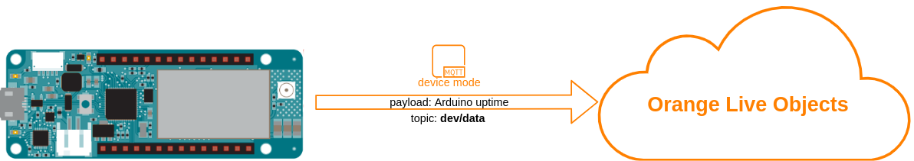
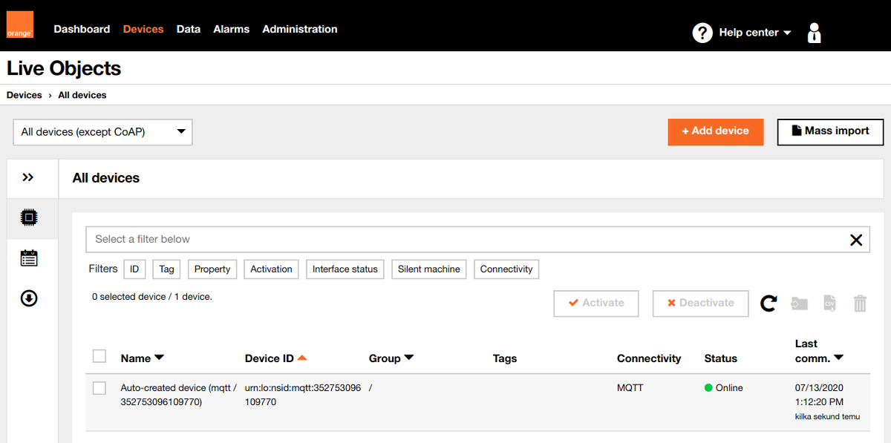
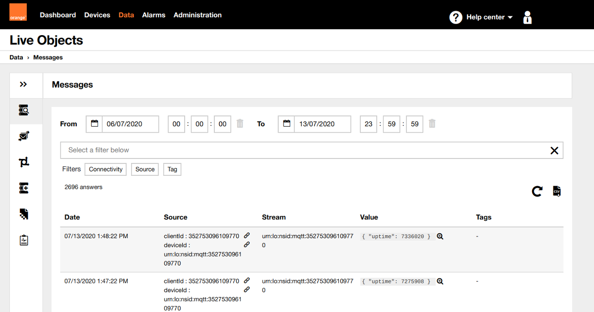

# Send data to Live Objects

This example shows how to send some sample data (device uptime) to Live Objects using Arduino MKR NB 1500.


## Running
First of all, be sure that you installed the required libraries and generated an API key mentioned in the main README file, then:
1. Open "1_send_data.ino" sketch using Arduino IDE
2. Replace ```const char SECRET_LIVEOBJECTS_API_KEY[]="...";``` in arduino_secrets.h with API key you generated
3. In ```lo.setSecurity()``` select security mode using ```TLS``` or ```NONE``` according to board abilities shown in **Compatibility** point in main **README.md**
4. Upload *1_send_data.ino* sketch to your Arduino MKR NB 1500 board


## Verify
**Is device online:**<br>
If all went fine under **devices** tab on Live Live Objects portal you should see online your device identified by its modem IMEI:



**Is device sending data:**<br>
Under data tab on Live Objects portal you should see messages sent by your device, along with values *{ "uptime": xxxxx }*


