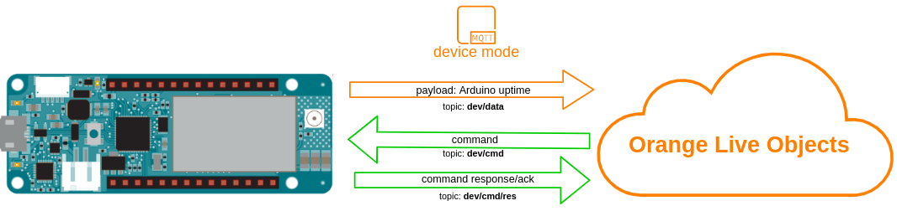

# Live Objects device commands

Commands can be used to trigger actions on the device.



In this example we will use command to make Arduino onboard LED blink.


## Running
First of all, be sure that you installed the required libraries and generated an API key mentioned in the main README file, then:
1. Open "4_simple_command.ino" sketch using Arduino IDE
2. Replace ```const char SECRET_LIVEOBJECTS_API_KEY[]="...";``` in arduino_secrets.h with API key you generated
3. In ```lo.setSecurity()``` select security mode using ```TLS``` or ```NONE``` according to board abilities shown in **Compatibility** point in main **README.md**
4. Upload *4_simple_command.ino* sketch to your Arduino MKR NB 1500 board

## Verify
**Is device online:**<br>
If all went fine under **devices** tab on Live Live Objects portal you should see online your device identified by its modem IMEI

## Send command
Now navigate to:<br>
**Devices->urn:lo:nsid:mqtt:[your_device_imei]->Commands** <br>
And click **"Add command"**<br>

Finally define your command like this:


After clicking "Validate" your command should be sent to the device and as an effect you should see the onboard LED blinking 5 times:


