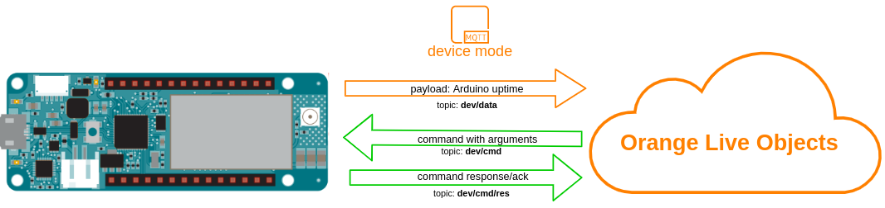
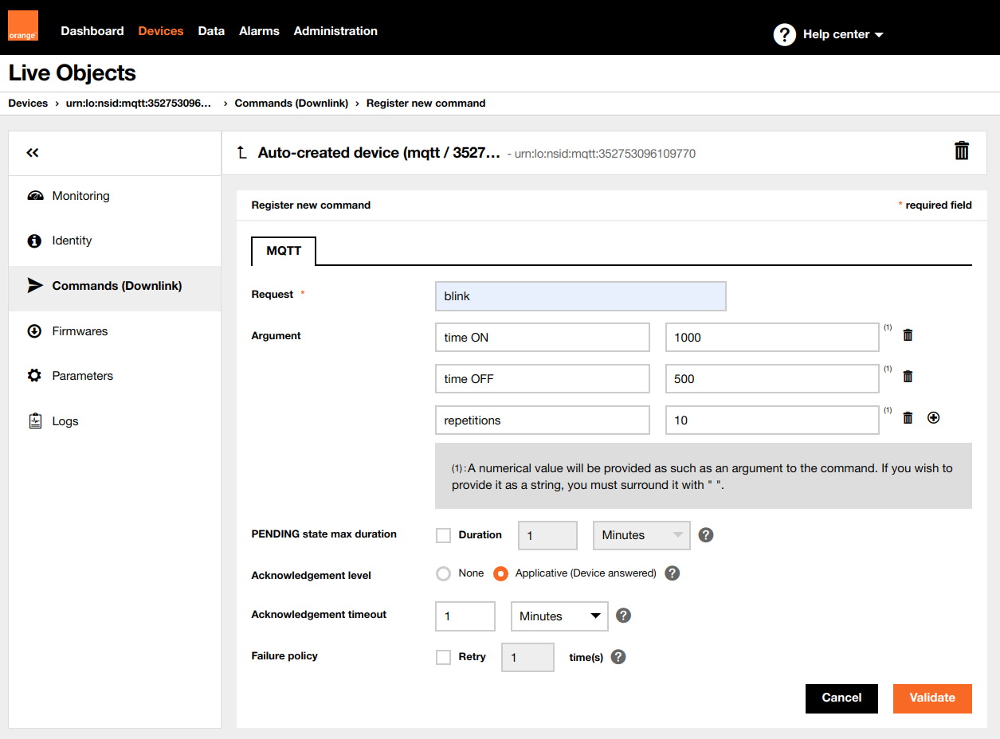

# Live Objects device commands with arguments

Commands can be used to trigger actions on the device. Additionally when creating the command on Live Objects, you can add some arguments which will be handled by device.



In this example we will use command to make Arduino onboard LED blink. Unlike in previous example where blink time and count was fixed, this time the on/off time of the LED and the repetitions will be passed as arguments in the command sent from Live Objects.


## Running
First of all, be sure that you installed the required libraries and generated an API key mentioned in the main README file, then:
1. Open "5_simple_command.ino" sketch using Arduino IDE
2. Replace ```const char SECRET_LIVEOBJECTS_API_KEY[]="...";``` in arduino_secrets.h with API key you generated
3. In ```lo.setSecurity()``` select security mode using ```TLS``` or ```NONE``` according to board abilities shown in **Compatibility** point in main **README.md**
4. Upload *5_simple_command.ino* sketch to your Arduino MKR NB 1500 board

## Verify
**Is device online:**<br>
If all went fine under **devices** tab on Live Live Objects portal you should see online your device identified by its modem IMEI

## Send command
Now navigate to:<br>
**Devices->urn:lo:nsid:mqtt:[your_device_imei]->Commands** <br>
And click **"Add command"**<br>

Define command like this:



After clicking "Validate" your command should be sent to the device and as an effect you should see the onboard LED blinking according to the parameters provided
