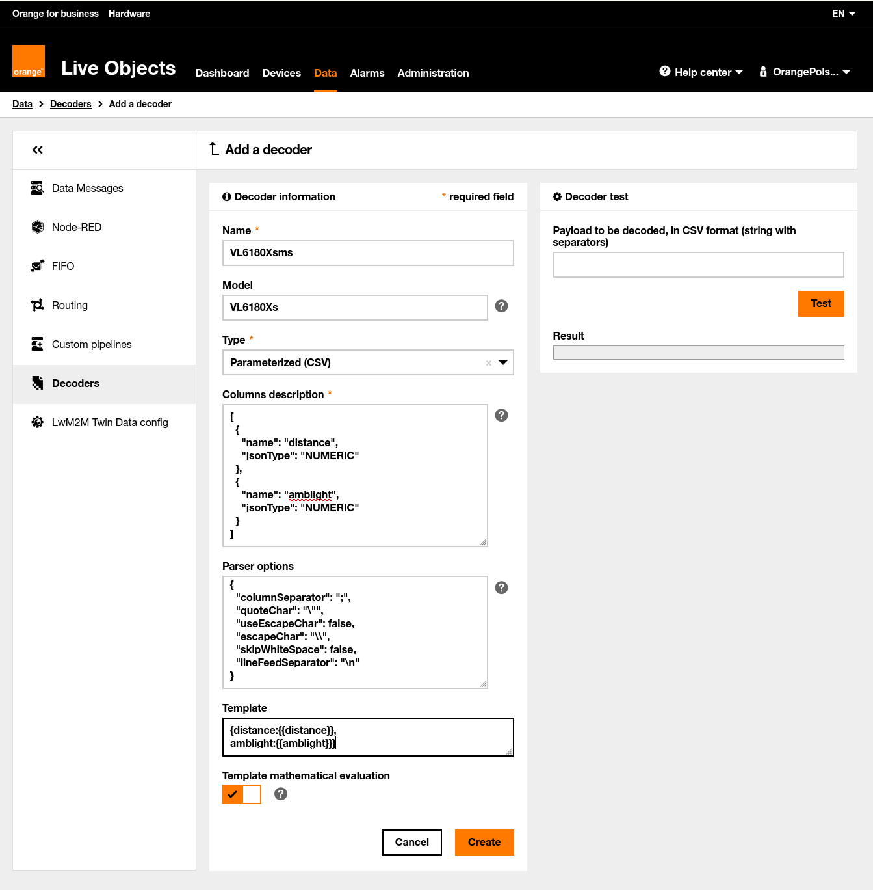

# Sending data from VL6180 sensor to Live Objects

This example shows how to send real data from sensor [VL6180X](https://www.st.com/resource/en/datasheet/vl6180x.pdf). Sensor delivers two useful values:
- ambient light [[lx](https://en.wikipedia.org/wiki/Lux)],
- distance from disturbance [mm].

In this use-case [an example of board using sensor](https://kamami.pl/en/kamod-kamami-peripheral-modules/559362-kamodvl6180x-a-module-with-distance-gesture-and-als-sensor.html) was being used.


## Our Setup view: 


## Preparations
### Installation VL6180X library
Using **Library Manager** from Arduino IDE (*Tools -> Manage Libraries...*) you need to install library:


### Diagram of connection
Module is controlled via I<sup>2</sup>C and accepts power and signal levels 3.3V.
MKR1010 WiFi setup diagram: 


For your board you need to connect power lines (**+3.3V, GND**) and I<sup>2</sup>C lines (**SDA, SCL**) to corresponding VL6180X lines.

### Decoder's preparation for MQTT devices
If you want to limit amount of data which are being sent from board to Live Objects portal you can use **BINARY** mode which is defined in ```lo.begin()``` in *7_distance_and_light_sensor.ino*: ```lo.begin(MQTT, BINARY, true);```. In this case both values: ambient light (1 byte) and distance (4 bytes) will be sent as only five bytes (see terminal output in point 6).

To achieve this goal, you need to create **private binary decoder** in Live Objects portal. Use: *Data -> Decoders -> +Add*. You an enter data as below and click **Save**.


<br>

### MQTT interface modification

You need to select your device for which you want to activate previously created **private binary decoder**. Click selected device from the list uder tab **Devices**.


<br>

Then click **Identity** and next click icon in red circle. After that in field **Decoder** you can select your decoder. Clicking **Save** finishes this step and activates our private decoder **VL6180Xbin** for MQTT interface for selected device.


## Running
First of all, be sure that you installed the required libraries and generated an API key mentioned in the main **README.md** file, then:
1. Open *7_distance_and_light_sensor.ino* sketch using Arduino IDE,
2. Replace ```const char SECRET_LIVEOBJECTS_API_KEY[]="...";``` in *arduino_secrets.h* with API key you generated,
3. Define necessary credentials for your board in *arduino_secrets.h*:
- for WiFi boards: 
    - ```extern const String SECRET_SSID = "...;```
    - ```extern const String SECRET_WIFI_PASS = "...";```
- for cellular boards:
    - ```extern const String SECRET_PINNUMBER = "...";``` (if needed),
    - ```extern const String SECRET_APN = "";``` (if needed),
    - ```extern const String SECRET_APN_USER = "...";``` (if needed),
    - ```extern const String SECRET_APN_PASS = "...";```   (if needed),
4. In ```lo.setSecurity()``` select security mode using ```TLS``` or ```NONE``` according to board abilities shown in **Compatibility** point in main **README.md**,
5. Upload *7_distance_and_light_sensor.ino* sketch to your board.
6. In your terminal window you should see similiar output:

```
15:31:22.732 -> 
15:31:22.732 -> VL6180X  sensor
15:31:22.732 -> Model ID = 180
15:31:22.732 -> Model Rev = 13
15:31:22.732 -> Module Rev = 12
15:31:22.732 -> Manufacture Date = 16/11/14 Phase: 1
15:31:22.732 -> 
15:31:23.762 -> 
15:31:23.762 -> *** Live Objects for Arduino MKR boards, revision 2.1.0 ***
15:31:24.526 -> [INFO] WiFi firmware version 1.2.4
15:31:24.526 -> [INFO] Attempting to connect to SSID: EdekAD57BA
15:31:28.279 -> 
15:31:28.279 -> [INFO] Connecting to MQTT broker mqtt.liveobjects.orange-business.com:1883
15:31:30.439 -> [INFO] You're connected to the MQTT broker
15:31:30.439 -> Sampling data
15:31:30.572 -> Sending data to Live Objects
15:31:30.572 -> [INFO] Publishing message on topic: dev/v1/data/binary
15:31:30.572 -> [INFO] 4041A9C28F
15:31:35.554 -> Sampling data
15:31:35.687 -> Sending data to Live Objects
15:31:35.687 -> [INFO] Publishing message on topic: dev/v1/data/binary
15:31:35.687 -> [INFO] 4841AEE148
...
```

## Verify
**Is device online:**
If all went fine under **Devices** tab on Live Live Objects portal you should see online your device identified by its modem IMEI or WiFi MAC address:


**Is device sending data:**
Under **Data** tab on Live Objects portal you should see messages sent by your device, along with values eg. *{ "distance": 110, "amblight": 192.63 }*


<br><br>

***
## SMS (cellular boards)

## Preparations

### SMS device creation
You need to manually add your cellular device as it is described in [this point](../6_sms_send_data/README.md).

### Decoder's preparation for SMS devices
If you want to limit amount of data which are being sent from board to Live Objects portal you can use pure **TEXT** mode which is defined in ```lo.begin()``` in *7_distance_and_light_sensor.ino*: ```lo.begin(SMS, TEXT, true);```. In this case both values: ambient light and distance will be transmitted as raw text.

To achieve this goal, you need to create **private sms decoder** in Live Objects portal. Use: *Data -> Decoders -> +Add*. You an enter data as below and click **Save**.



### SMS interface modification

You need to modify SMS interface for you device in similar way as for MQTT device selecting **VL6180Xsms** decoder.

## Running
First of all, be sure that you installed the required libraries and generated an API key mentioned in the main **README.md** file, then:
1. Open *7_distance_and_light_sensor.ino* sketch using Arduino IDE,
2. Replace ```const char SECRET_LIVEOBJECTS_API_KEY[]="...";``` in *arduino_secrets.h* with API key you generated,
3. Specify the number of sever (gate) in *arduino_secrets.h*:
    - ```extern const String SECRET_SERVER_MSISDN = "...";```,
4. In ```lo.setSecurity()``` select security mode ```NONE```
5. Upload *7_distance_and_light_sensor.ino* sketch to your board.
6. In your terminal window you should see similiar output:

```
3:00:46.470 -> VL6180X  sensor
13:00:46.470 -> Model ID = 180
13:00:46.470 -> Model Rev = 13
13:00:46.470 -> Module Rev = 12
13:00:46.470 -> Manufacture Date = 16/11/14 Phase: 1
13:00:46.470 -> 
13:00:47.467 -> 
13:00:47.467 -> *** Live Objects for Arduino MKR boards, revision 2.1.0 ***
13:00:52.151 -> [INFO] Connecting to cellular network
13:01:00.558 -> 
13:01:00.758 -> [INFO] You're connected to the network
13:01:00.758 -> Sampling data
13:01:00.891 -> Sending data to Live Objects
13:01:00.891 -> [INFO] Publishing message: 122;310.17;
13:01:06.740 -> Sampling data
13:01:06.840 -> Sending data to Live Objects
13:01:06.840 -> [INFO] Publishing message: 255;300.67;
...
```

## Verify

You can verify if device is online and data are delivered in the same way as it is described for MQTT device.
