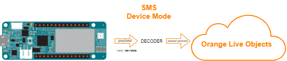
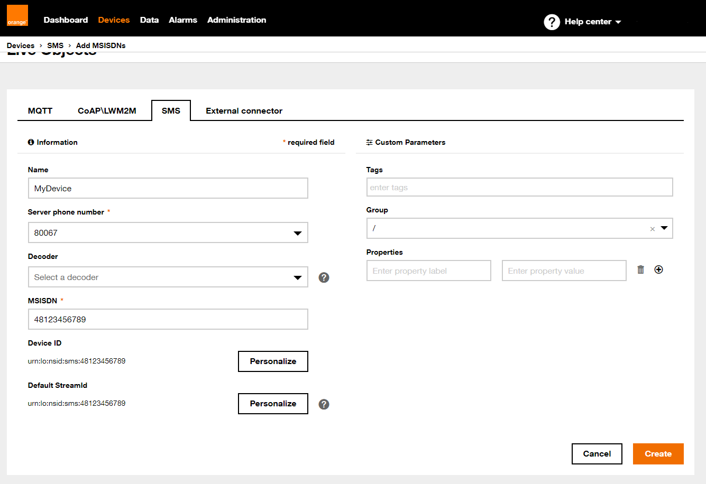
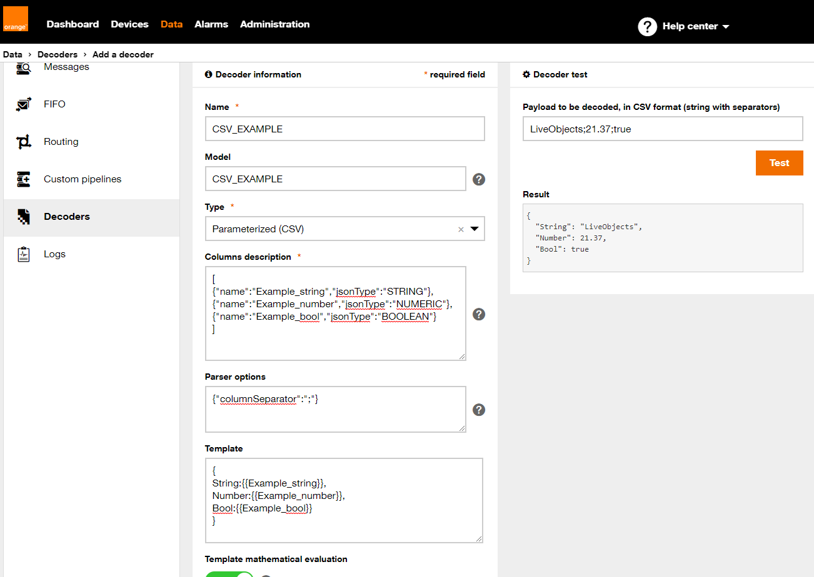
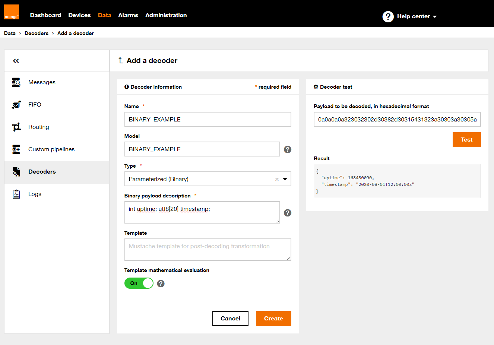

# Live Objects using SMS protocol

SMS protocol can be used the same as MQTT protocol, but in addition you have to create device interface manualy.

This protocol has 2 modes, text and binary. You can specify which u want to use in function `lo.begin(SMS, mode, true)`. Simply replace mode with `TXT` or `BINARY`



In this example we will sent uptime and timestamp to LiveObjects in `TXT` mode.

## Preparations
You have to create a device interface. Go to Devices->Add device. Select SMS tab then complete necessary fields like MSISDN (phone number) and select Server phone number.

**:warning: yours MSISDN have to be preceeded by area code**

Next click Create.


## Running
First of all, be sure that you installed the required libraries and generated an API key mentioned in the main README file, then:
1. Open "6_sms_protocol.ino" sketch using Arduino IDE
2. Replace ```extern const String SECRET_LIVEOBJECTS_API_KEY="";``` in arduino_secrets.h with API key you generated
3. Replace ```extern const String SECRET_SERVER_MSISDN="";``` with number you have choosen while creating device interface.
4. Upload *5_simple_command.ino* sketch to your Arduino MKR board

## Verify
**Is device sending data:**<br>
Under data tab on Live Objects portal you should see messages sent by your device. The data doesn't look preety especialy if you are using binary mode.

## Parse incoming data using decoders

Go to Data->Decoders then click +Add. Fill the name and model fields then choose type of the decoder.

**CSV Example**

Column description

```Json:
[
    {"name":"Example_string","jsonType":"STRING"},
    {"name":"Example_number","jsonType":"NUMERIC"},
    {"name":"Example_bool","jsonType":"BOOLEAN"}
]
```

Parser options:

```Json
{
    "columnSeparator":";"
}
```

Template:

```
{
    String : {{Example_string}},
    Number : {{Example_number}},
    Bool   : {{Example_bool}}
}
```

Result should look like this:



**Binary Example**

Binary payload description
```C++
int uptime; utf8[20] timestamp;
```
